# SystemForge AI


## Overview

SystemForge AI helps engineering teams redesign legacy or underperforming production systems into scalable, fault-tolerant, and modern architectures.

Instead of manually reviewing infrastructure bottlenecks, engineers can describe their current system and SystemForge AI generates:

* Production-grade architecture redesign recommendations
* Scalability improvements
* Reliability and fault-tolerance strategies
* Cost optimization suggestions
* Modern cloud-native architecture patterns
* Downloadable architecture reports in PDF format

This project was built for the focusing on practical AI solutions powered by AMD infrastructure.

---

## Problem Statement

Many startups and engineering teams launch products quickly but struggle later with:

* poor scalability
* high infrastructure costs
* deployment bottlenecks
* weak fault tolerance
* lack of observability
* production incidents caused by architectural debt

Architecture reviews are often expensive, slow, and require senior system design expertise.

### The challenge

How can teams quickly receive expert-level production architecture recommendations without waiting for expensive consulting cycles?

---

## Solution

SystemForge AI acts as an AI Architecture Consultant.

Users provide:

* current system details
* workloads
* bottlenecks
* deployment setup
* infrastructure constraints

The platform analyzes the system and generates:

### Output Includes

* architecture redesign recommendations
* distributed system improvements
* reliability upgrades
* deployment optimization
* scaling strategies
* service decomposition suggestions
* infrastructure modernization paths
* downloadable architecture report (PDF)

This reduces architecture review time from days to minutes.

---

## Why It Matters

Modern production systems fail because of architectural decisions—not code quality.

SystemForge AI helps teams:

* prevent production outages
* reduce cloud costs
* improve system reliability
* scale confidently
* accelerate technical decision-making

This creates real business impact for startups, SaaS platforms, and enterprise engineering teams.

---

## AMD Integration

## Where AMD Is Used

SystemForge AI uses AMD-powered inference infrastructure for generating architecture recommendations.

### AMD-Powered Components

* AMD inference endpoints
* AMD model serving infrastructure
* LLM execution powered through AMD-supported deployment
* high-performance inference for architecture generation workflows

### Why AMD

AMD enables:

* faster model inference
* production-grade reliability
* scalable AI execution
* efficient deployment for real-world enterprise use cases

This project is not just using AI—it is built on infrastructure designed for production AI workloads.

That is the core alignment with the AMD Developer Hackathon.

---

## Features

### Core Features

* AI-based production architecture redesign
* architecture optimization engine
* fault tolerance recommendations
* cost optimization suggestions
* scalability planning
* cloud-native modernization guidance
* PDF architecture report generation
* production-ready deployment

### Engineering Features

* Next.js frontend
* FastAPI backend
* API proxy architecture
* Hugging Face Spaces deployment
* environment-based configuration
* production-safe API routing

---

## Tech Stack

## Frontend

* Next.js
* TypeScript
* React
* CSS

## Backend

* FastAPI
* Python
* PDF report generation

## AI Layer

* AMD inference infrastructure
* LLM orchestration
* architecture workflow engine

## Deployment

* Hugging Face Spaces

---

## Architecture

```text
User Input
   ↓
Next.js Frontend
   ↓
Next.js API Proxy Routes
   ↓
FastAPI Backend
   ↓
AMD-Powered Inference Engine
   ↓
Architecture Generation Workflow
   ↓
Final Recommendations + PDF Report
```

### Important Production Design Decision

Frontend does NOT call FastAPI directly.

Instead, Next.js API routes act as a proxy:

```text
Frontend → /api/run-systemforge → FastAPI
Frontend → /api/download-report → FastAPI
```

This solves:

* CORS issues
* localhost deployment failures
* production environment inconsistencies
* browser loopback permission problems

This was a major production deployment improvement.

---

## Screenshots

Add your screenshots here before final submission.

Recommended screenshots:

* Home page
* Input workflow page
* Generated architecture output
* PDF report generation
* Final production architecture recommendations

Example:


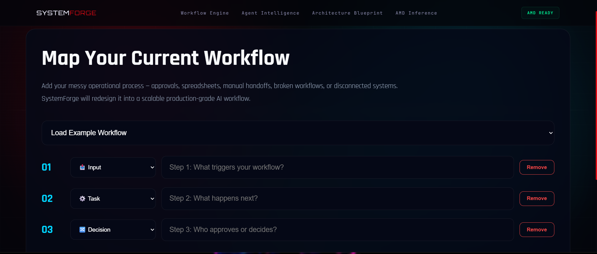
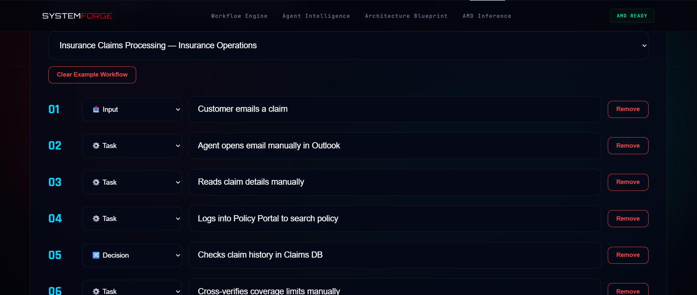
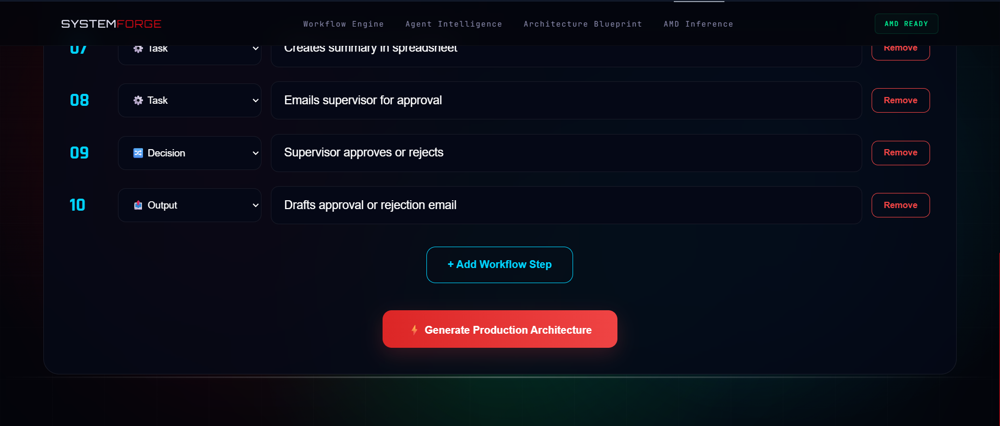


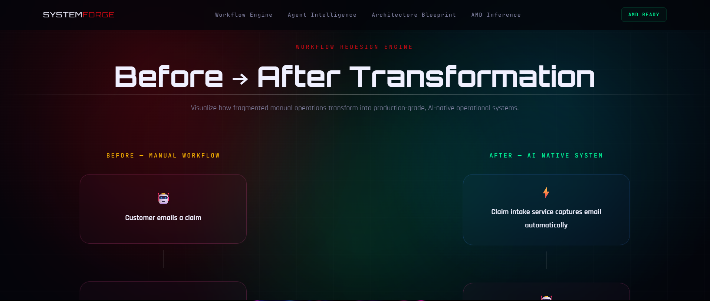

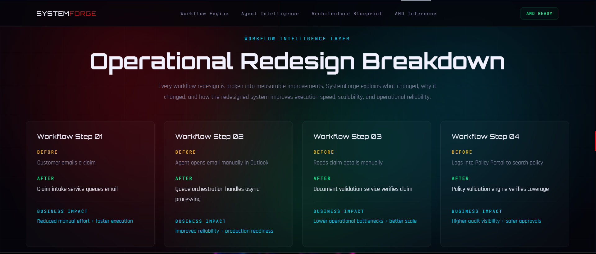

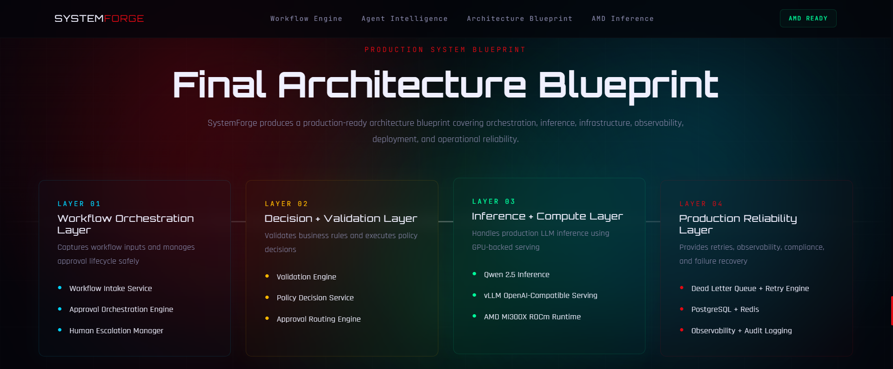

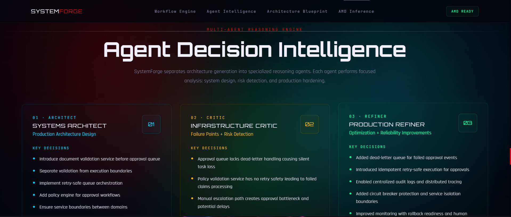

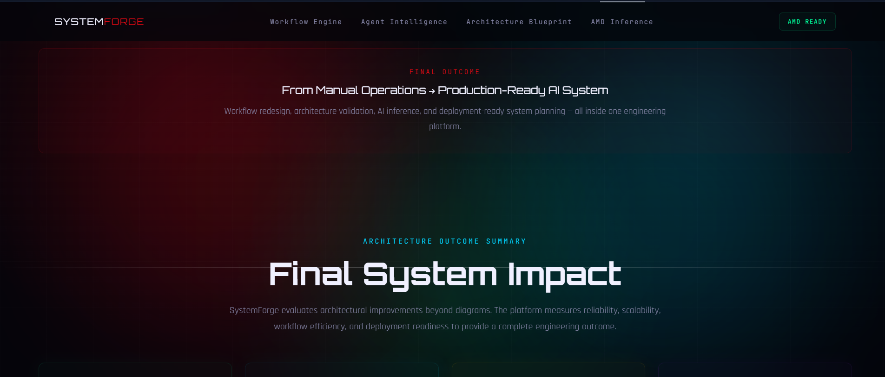

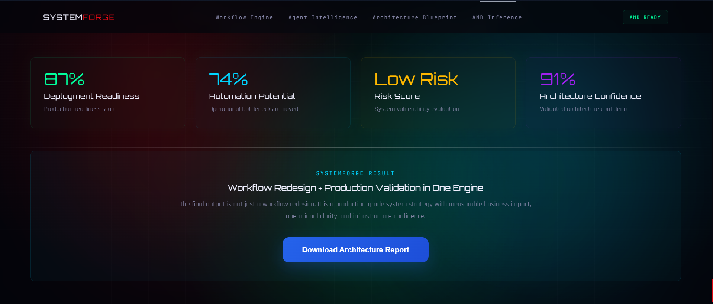

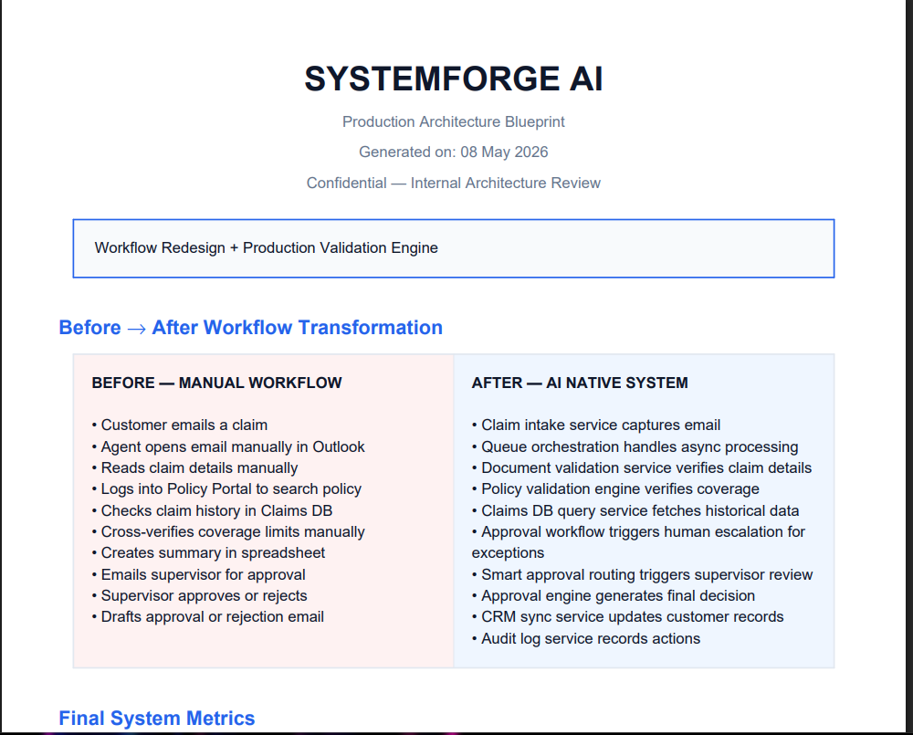

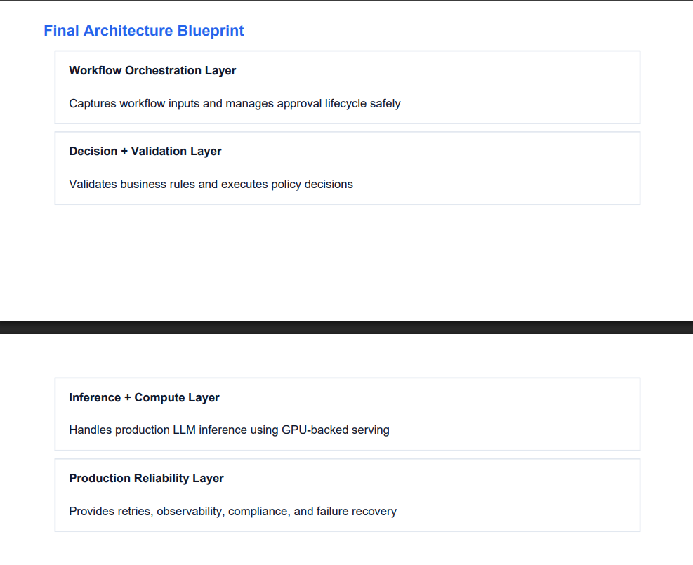

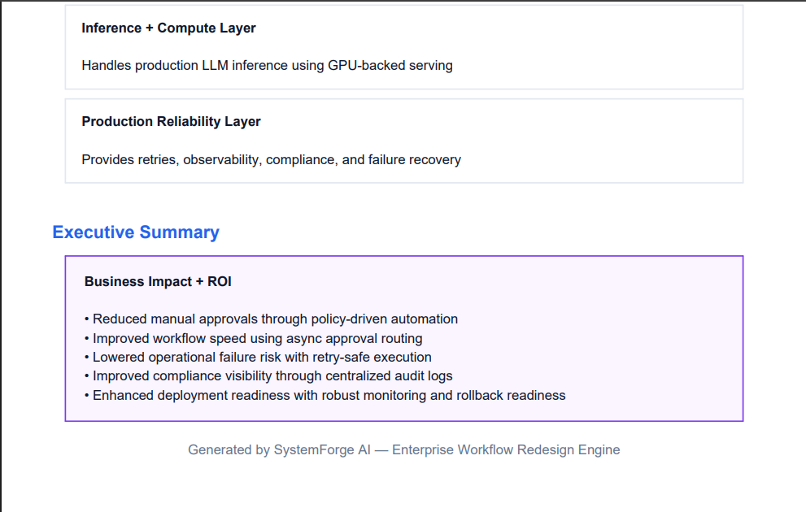
---

## Live Deployment

### Hugging Face Space

[https://huggingface.co/spaces/lablab-ai-amd-developer-hackathon/systemforge-ai](https://huggingface.co/spaces/lablab-ai-amd-developer-hackathon/systemforge-ai)

---

### Vercel Live Demo

[https://systemforge-ai.vercel.app/](https://systemforge-ai.vercel.app/)

---

## GitHub Repository

### Source Code

[https://github.com/jacobjerryarackal/systemforge-ai](https://github.com/jacobjerryarackal/systemforge-ai)

---

## Local Setup

## Clone Repository

```bash
git clone https://github.com/jacobjerryarackal/systemforge-ai.git
cd systemforge-ai
```

---

## Backend Setup

```bash
python -m venv venv
source venv/bin/activate
# Windows
venv\Scripts\activate

pip install -r requirements.txt
```

### Run Backend

```bash
uvicorn main:app --reload
```

Backend runs on:

```text
http://127.0.0.1:8000
```

---

## Frontend Setup

```bash
cd frontend
npm install
npm run dev
```

Frontend runs on:

```text
http://localhost:3000
```

---

## Environment Variables

### Frontend `.env.local`

```env
NEXT_PUBLIC_API_URL=http://127.0.0.1:8000
NEXT_PUBLIC_BACKEND_URL=http://127.0.0.1:8000
NEXT_PUBLIC_MOCK_MODE=false
```

### Backend `.env`

```env
AMD_API_KEY=your_key
AMD_BASE_URL=your_base_url
AMD_MODEL=your_model
MODEL_NAME=your_model
LLM_PROVIDER=amd
USE_MOCK_MODE=false
```

For production deployment, these variables must be added inside Hugging Face Space settings.

---

## Deployment Notes

### Important

Do NOT expose backend directly to the browser.

Use API proxy routes:

```text
frontend/app/api/run-systemforge/route.ts
frontend/app/api/download-report/route.ts
```

This ensures stable production deployment.

---

## Third-Party Services Disclosure

This project uses:

* Next.js
* FastAPI
* Hugging Face Spaces
* AMD inference infrastructure
* LLM APIs for architecture generation
* PDF generation libraries

These services are used to support production deployment and AI workflow execution.

---

## Future Roadmap

Planned improvements:

* architecture diagram visualization
* multi-cloud recommendations
* Kubernetes optimization mode
* observability recommendations
* CI/CD redesign suggestions
* security architecture review
* FinOps optimization engine
* enterprise architecture dashboard

---

## Hackathon Submission Notes

This project was built specifically for:

## AMD Developer Hackathon — Track 1

Focus areas:

* practical AI product
* production deployment
* real business value
* AMD-powered infrastructure usage
* scalable implementation

SystemForge AI is designed as a real-world engineering productivity platform, not just a prototype.

---

## Author

### Jacob Jerry Arackal

Generative AI Engineer | Full Stack Developer | System Design Enthusiast

Built with a strong focus on production-grade AI systems and real-world deployment.

---
